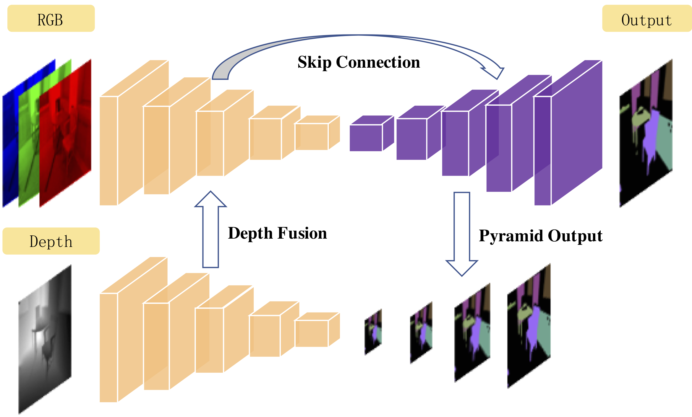

# RedNet

This repository contains the official implementation of the RedNet (Residual Encoder-Decoder Architecture). It turns out that the simple encoder-decoder structure is powerful when combined with residual learning. For further details of the network, please refer to our article [RedNet: Residual Encoder-Decoder Network for indoor RGB-D Semantic Segmentation](http://bit.ly/2MrIT78).



<!--  -->

## Dependencies:

PyTorch 0.4.0, TensorboardX 1.2 and other packages listed in `requirements.txt`.

## Dataset

The RedNet model is trained and evaluated with the [SUN RGB-D Benchmark suit](http://rgbd.cs.princeton.edu/paper.pdf). Please download the data on the [official webpage](http://rgbd.cs.princeton.edu), unzip it, and place it with a folder tree like this,

```bash
SOMEPATH # Some arbitrary path
├── SUNRGBD # The unzip folder of SUNRGBD.zip
└── SUNRGBDtoolbox # The unzip folder of SUNRGBDtoolbox.zip
```

The root path `SOMEPATH` should be passed to the program using the `--data-dir SOMEPATH` argument.

## Usage:

For training, you can pass the following argument,

```
python RedNet_train.py --cuda --data-dir /path/to/SOMEPATH
```

If you do not have enough GPU memory, you can pass the `--checkpoint` option to enable the checkpoint container in PyTorch >= 0.4. For other configuration, such as batch size and learning rate, please check the ArgumentParser in [RedNet_train.py](RedNet_train.py).

For inference, you should run the [RedNet_inference.py](RedNet_inference.py) like this,

```
python RedNet_inference.py --cuda --last-ckpt /path/to/pretrained/model.pth -r /path/to/rgb.png -d /path/to/depth.png -o /path/to/output.png
```

The pre-trained weight is released [here](http://bit.ly/2KDLeu9) for result reproduction.

## Citation

If you find this work to be helpful, please consider citing the paper,

    @article{jiang2018rednet,
      title={RedNet: Residual Encoder-Decoder Network for indoor RGB-D Semantic Segmentation},
      author={Jiang, Jindong and Zheng, Lunan and Luo, Fei and Zhang, Zhijun},
      journal={arXiv preprint arXiv:1806.01054},
      year={2018}
    }

## License

This software is released under a creative commons license which allows for personal and research use only.
For a commercial license please contact the authors.
You can view a license summary here: http://creativecommons.org/licenses/by-nc/4.0/
